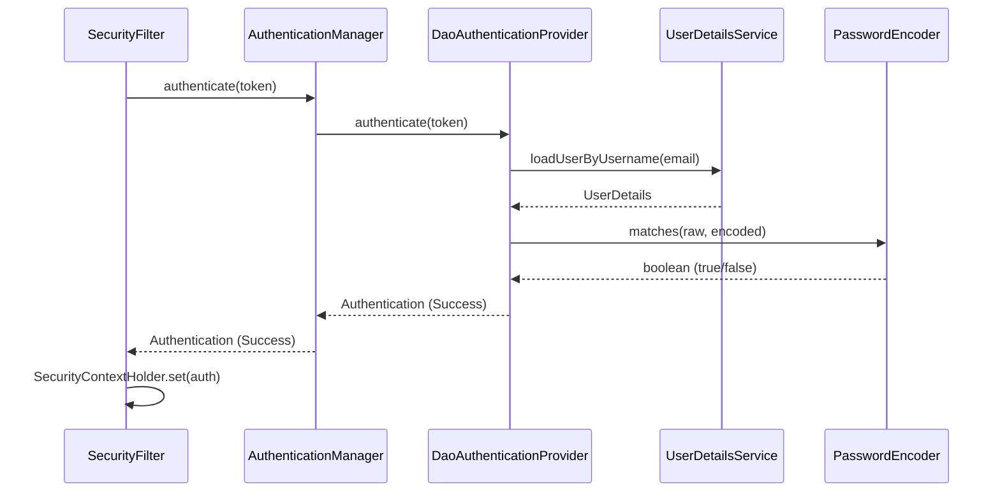
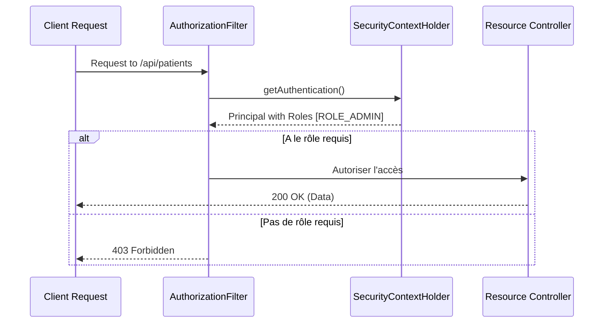
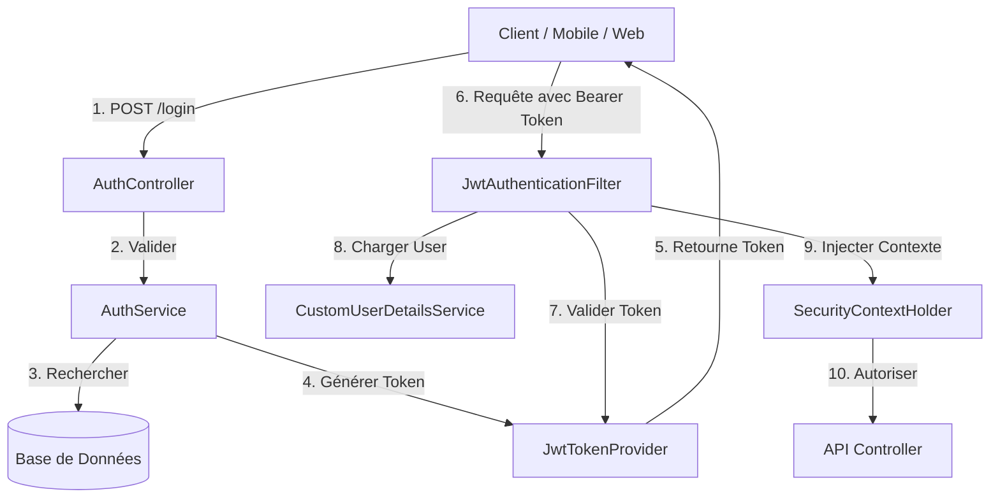
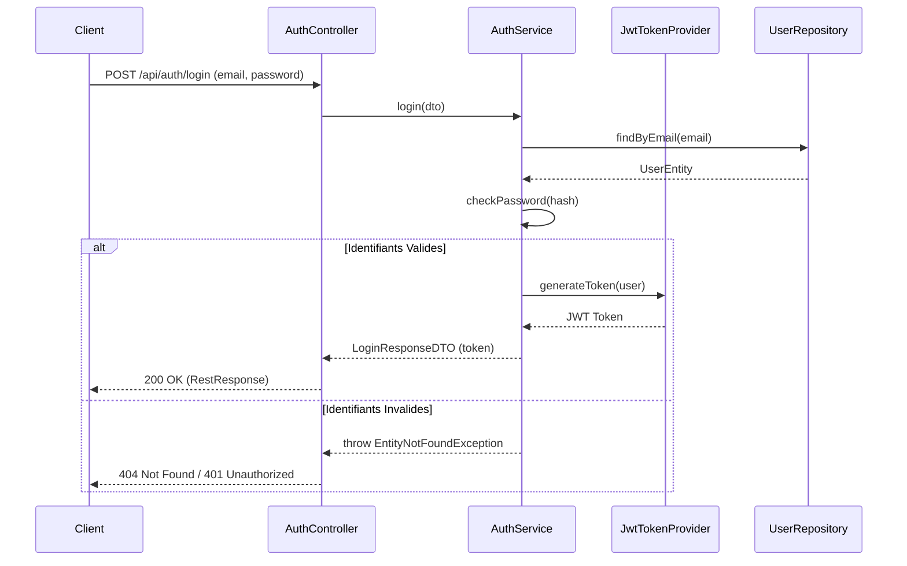

# 🔐 Manuel de Procédure : Mise en place de l'Authentification JWT

Ce manuel détaille les étapes techniques pour implémenter un système d'authentification robuste et stateless utilisant **Spring Security** et **JSON Web Tokens (JWT)**.

---

## 🚀 Concepts Clés de Spring Security

Avant d'entamer l'implémentation, il est essentiel de comprendre les piliers de Spring Security :

| Concept | Description |
| :--- | :--- |
| **Authentication** | Le processus de vérification de **qui** est l'utilisateur (identifiant/mot de passe). |
| **Authorization** | Le processus de vérification de **ce que** l'utilisateur a le droit de faire (Rôles/Permissions). |
| **SecurityFilterChain** | Une chaîne de filtres que chaque requête doit traverser. C'est ici que l'on définit les règles de sécurité. |
| **SecurityContextHolder** | C'est l'endroit où Spring Security stocke les détails de l'utilisateur actuellement authentifié. |
| **AuthenticationManager** | Le composant qui coordonne le processus d'authentification. |
| **UserDetailsService** | Interface utilisée pour charger les données de l'utilisateur (depuis une DB, LDAP, etc.). |
| **GrantedAuthority** | Représente une permission ou un rôle accordé à l'utilisateur (ex: `ROLE_ADMIN`). |
| **PasswordEncoder** | Service utilisé pour hasher les mots de passe et les comparer de manière sécurisée. |

### Comment ils interagissent ?
Lorsqu'une requête arrive, elle passe par le **SecurityFilterChain**. Si c'est une tentative de login, l'**AuthenticationManager** utilise le **UserDetailsService** pour récupérer l'utilisateur et le **PasswordEncoder** pour vérifier le mot de passe. Si tout est correct, l'utilisateur est stocké dans le **SecurityContextHolder**, et ses **GrantedAuthority** sont utilisées pour l'**Authorization** sur les routes suivantes.

#### Flux interne d'Authentification :


#### Flux de Contrôle d'Accès (Authorization) :


---

## 1. Architecture Globale
L'authentification repose sur un système de filtrage qui intercepte chaque requête pour valider l'identité de l'utilisateur.



---

## 2. Diagramme de Séquence : Authentification (Login)
Voici le flux détaillé lors de la connexion d'un utilisateur.



---

## 3. Étapes de Mise en Place

### Étape 1 : Modèle de Données (Entities)
L'entité utilisateur doit implémenter `UserDetails` pour être compatible avec Spring Security.

```java
@Entity
public class User implements UserDetails {
    @Id @GeneratedValue(strategy = GenerationType.IDENTITY)
    protected Long id;
    protected String email;
    protected String password; // Doit être hashé avec BCrypt
    
    @ManyToMany(fetch = FetchType.EAGER)
    protected Set<Role> roles;

    @Override
    public Collection<? extends GrantedAuthority> getAuthorities() {
        return roles.stream()
                .map(role -> new SimpleGrantedAuthority("ROLE_" + role.getName()))
                .toList();
    }
}
```

### Étape 2 : Le Fournisseur de Token (JwtTokenProvider)
Ce service gère la création et la lecture des tokens via la bibliothèque JJWT.

```java
@Service
public class JwtTokenProvider {
    @Value("${jwt.secret}")
    private String jwtSecret;

    public String generateToken(UserDetails userDetails) {
        SecretKey key = Keys.hmacShaKeyFor(jwtSecret.getBytes());
        return Jwts.builder()
                .subject(userDetails.getUsername())
                .signWith(key)
                .compact();
    }
}
```

### Étape 3 : Le Filtre de Sécurité (JwtAuthenticationFilter)
Il intercepte les appels pour vérifier si un token est présent dans les headers `Authorization`.

```java
public class JwtAuthenticationFilter extends OncePerRequestFilter {
    @Override
    protected void doFilterInternal(HttpServletRequest request, HttpServletResponse response, FilterChain filterChain) {
        String token = getJwtFromRequest(request);
        if (tokenProvider.validateToken(token)) {
            String username = tokenProvider.getUsernameFromToken(token);
            UserDetails user = userDetailsService.loadUserByUsername(username);
            UsernamePasswordAuthenticationToken auth = new UsernamePasswordAuthenticationToken(user, null, user.getAuthorities());
            SecurityContextHolder.getContext().setAuthentication(auth);
        }
        filterChain.doFilter(request, response);
    }
}
```

### Étape 4 : Configuration de Spring Security (SecurityConfig)
C'est ici que l'on définit les routes publiques et l'injection du filtre JWT.

```java
@Configuration
@EnableWebSecurity
public class SecurityConfig {
    @Bean
    public SecurityFilterChain filterChain(HttpSecurity http) throws Exception {
        http
            .csrf(csrf -> csrf.disable()) 
            .sessionManagement(s -> s.sessionCreationPolicy(SessionCreationPolicy.STATELESS))
            .authorizeHttpRequests(auth -> auth
                .requestMatchers("/api/auth/**").permitAll() 
                .anyRequest().authenticated() 
            )
            .addFilterBefore(jwtAuthenticationFilter(), UsernamePasswordAuthenticationFilter.class);
        return http.build();
    }
}
```

---

## 4. Guide d'Utilisation des Tests
Pour tester votre implémentation, utilisez un fichier `.http` ou Postman :

1.  **Login** : Envoyer les identifiants pour recevoir le token.
2.  **Accès Protégé** : Insérer le token dans le header `Authorization: Bearer <votre_token>`.

---

> [!IMPORTANT]
> **Sécurité** : Ne commitez jamais votre `jwt.secret` dans un dépôt public. Utilisez des variables d'environnement ou un gestionnaire de secrets (comme Vault).
